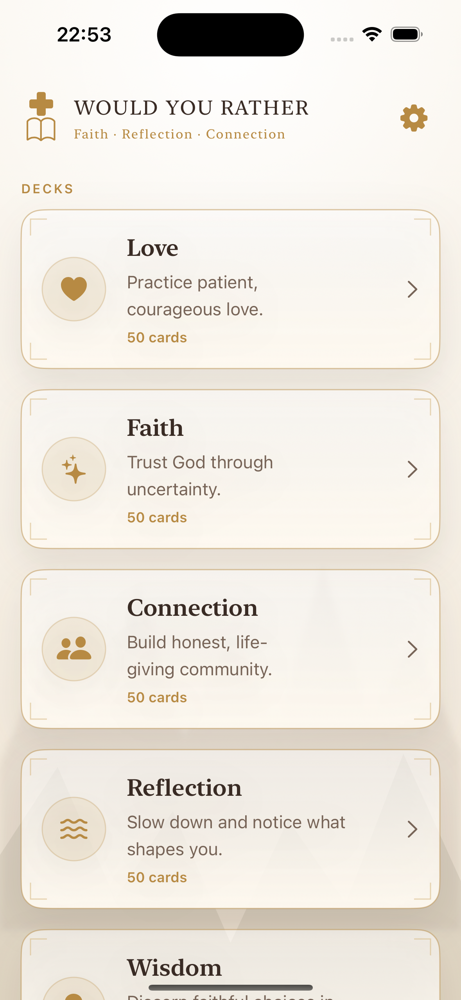
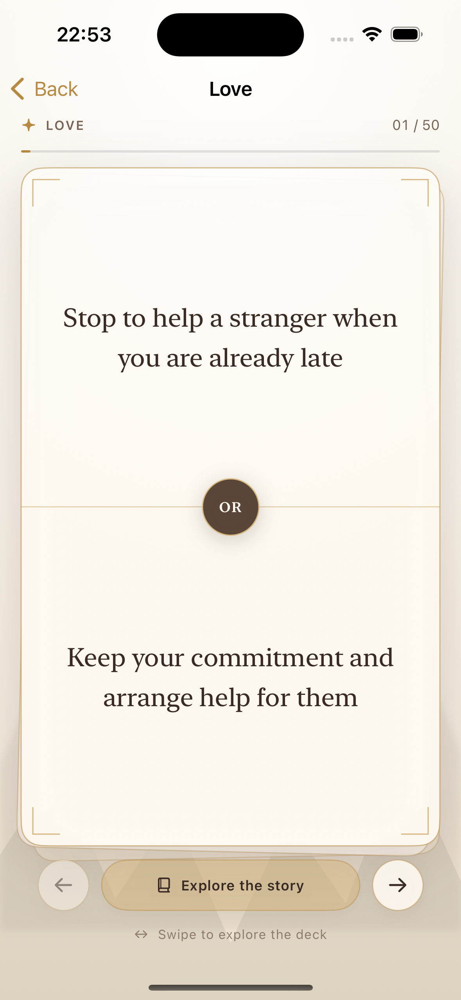
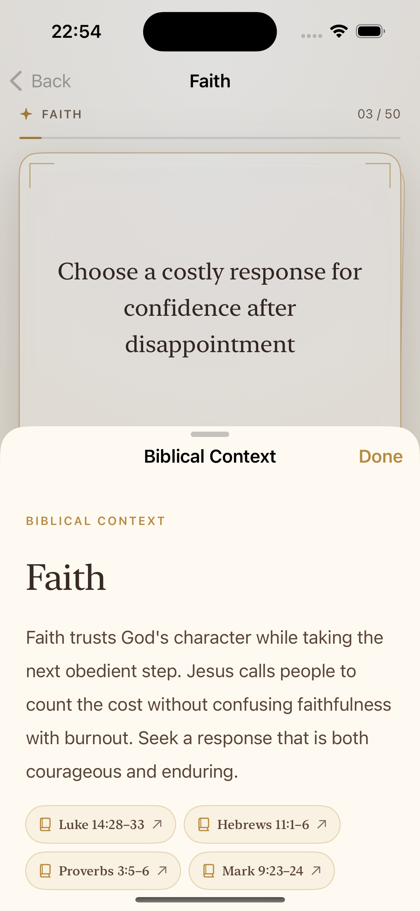

  

# Would You Rather: Faith

  A bilingual, Scripture-centered conversation-card app for iPhone and iPad.

Choose between two meaningful responses, reflect on the decision, and explore related biblical context. The app contains 600 prompts across 12 themes: Love, Faith, Connection, Reflection, Wisdom, Prayer, Purpose, Courage, Gratitude, Forgiveness, Service, and Hope.

## App preview

<table>
  <tr>
    <td align="center"></td>
    <td align="center"></td>
    <td align="center"></td>
  </tr>
  <tr>
    <td align="center">Deck library</td>
    <td align="center">Card session</td>
    <td align="center">Biblical context</td>
  </tr>
</table>

## Features

- 12 themed decks with 50 cards in each deck
- Complete English and Simplified Chinese content
- Swipe gestures and accessible previous/next controls
- Animated parchment card deck with A/B choice feedback
- Biblical context with several relevant Bible.com passages
- Local choice history, available from Settings
- On-device persistence with no account or sign-in
- Adaptive iPhone and iPad layouts
- VoiceOver labels and Reduce Motion support

## Navigation

The deck library is the app's main screen. Open Settings from the gear beside the title; Settings contains language selection, History, privacy information, and app details.

## Requirements

- Xcode 26 or later
- iOS 17 or later

## Run locally

1. Open `WouldYouRather.xcodeproj` in Xcode.
2. Select the `WouldYouRather` scheme.
3. Choose an iPhone or iPad simulator.
4. Press **Run** or use `Command-R`.

The project uses SwiftUI and has no external runtime dependencies.

## Project structure

- `WouldYouRather/` — app views, state, content catalog, persistence, and assets
- `WouldYouRatherTests/` — catalog, localization, link, and persistence tests
- `Artwork/` — editable app-icon artwork
- `pics/` — README screenshots
- `TECH_DESIGN.md` — architecture and interaction design
- `IMPLEMENTATION_PLAN.md` — completed work and release checklist

## Privacy and Scripture links

Choices and language preferences remain on the device. The app connects to the internet only when the user opens a Bible reference. English references open the NIV and Chinese references open CUNPSS on Bible.com; Scripture translation text is not bundled or reproduced in the app.

## Content review

The questions use a broad, non-denominational Christian posture. Before publishing, the Simplified Chinese translations and pastoral framing should be reviewed by fluent readers and qualified ministry leaders.

## License

Copyright 2026 Zheng Rongyan. The code, visual design, artwork, screenshots, and documentation are available under the [PolyForm Noncommercial License 1.0.0](LICENSE), together with the required notices in [NOTICE](NOTICE).

Noncommercial study, modification, and redistribution are permitted under those terms. Commercial use requires a separate written license from the licensor. Because commercial use is restricted, this project is source-available rather than OSI-approved open source.
